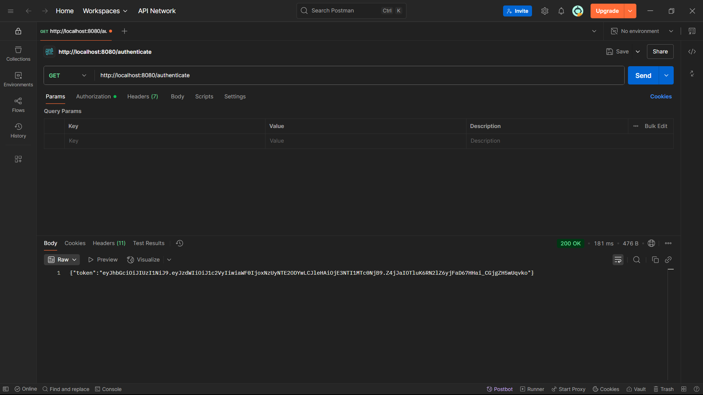

Authentication service that returns JWT :

In this exercise we are asked to create a project where the user sends the credentials and igt returns JWT.

First we created a project file and added the required dependencies.

Then we created a controller method with end point "/authenticate".

We used HS256 which is a combination of HMAC and SHA - 256 which are part of jjwt library for generating a token to the user.

After added all the required files and code, we will get the token as output.

OUTPUT :

