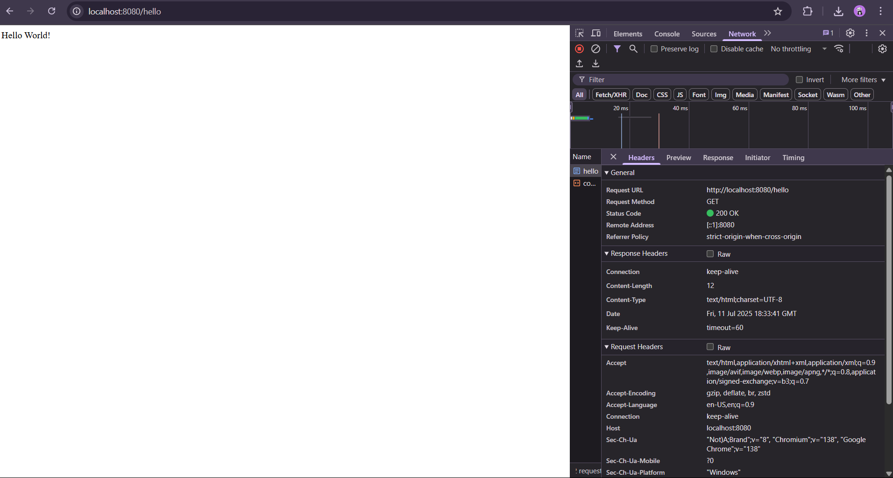
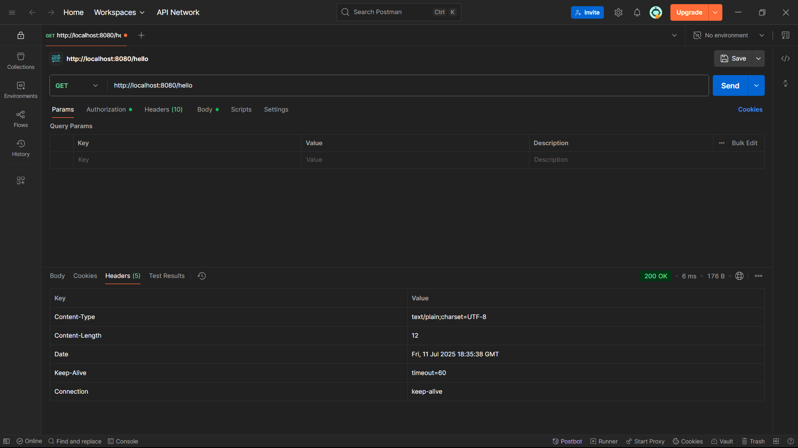
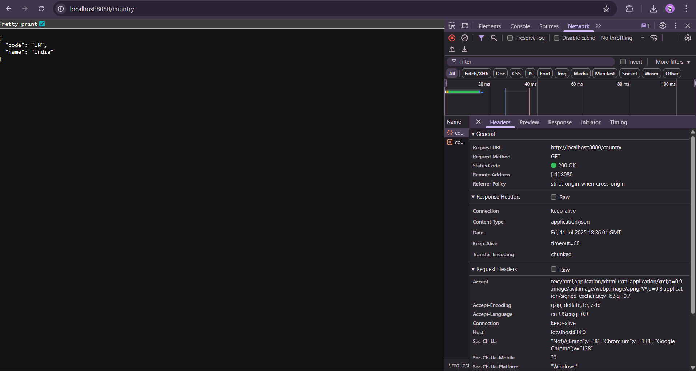
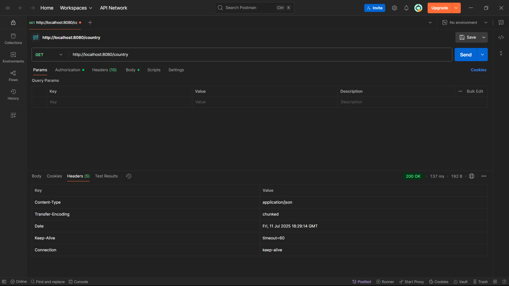
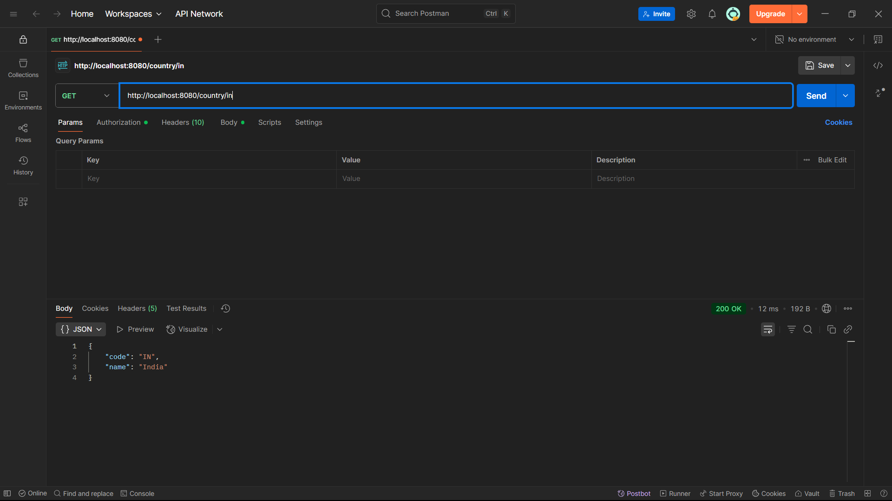

Spring Web Project using Maven :

In this exercise we are asked to create a spring web project using maven with the help of Spring initializr.

We added the Spring Dev tools and Spring Web dependencies and extracted the project file.

After that we ran the file using the given mvn clean package line and build project successfully.

After that we looked the project structure, main() method and the purpose of the @SpringBootApplication annotation.

And finally we saw the dependencies in the pom.xml file and the hierarchy of the dependency tree.

Added Load Country from Spring Configuration xml :

In this exercise we are asked to create a xml file and add beans to show the country with code.

First we add the country.xml file and add the bean with id, class, name and value attribute.

Then create a Country class to represent the country value in it like a pojo file.

After adding all the required files and code we run and get the output.

OUTPUT :

Country : Country [code=IN, name=India]

Process finished with exit code 0

Added Hello World RESTful Web Service :

In this exercise we are asked to write a REST service that returns text "Hello World!" using spring web framework.

First we created a Controller package and added a HelloController.java file in it.

Then added the required annotations and the sayhello() method that returns Hello World! as string message.

We set the end point as hello and also added the logger for start and end of the sayhello() method.

Then ran and tested it in both the Chrome browser and postman to check the output.

OUTPUT :

Added REST Country Web Service :

In this controller method we added a request mapping to fetch and give the country name and code.

OUTPUT :

Added Get Country Based on Code :

In this we added a controller method in which we can get the country based on the code given in the url.

OUTPUT :

