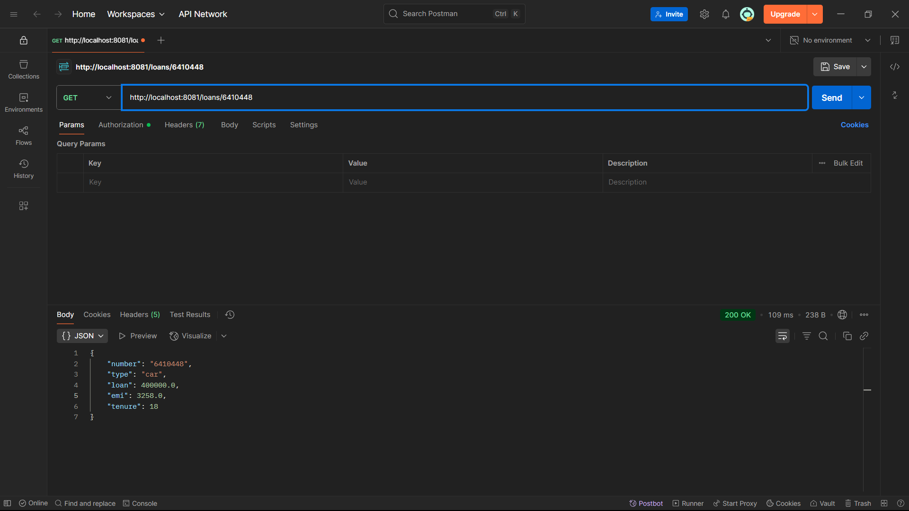

Microservices for Acoount and Loan :

Microservices means making a bunch of small works together without any error or crashing to make one big system.

Here we have accounts and loan which separately runs to a single account as we can say.

Now when we create them and run they will crash by running on the same port so we change the server port of loan to 8081.

Now after adding the file and code for both the accounts and loans we run and test the output.

OUTPUT :

