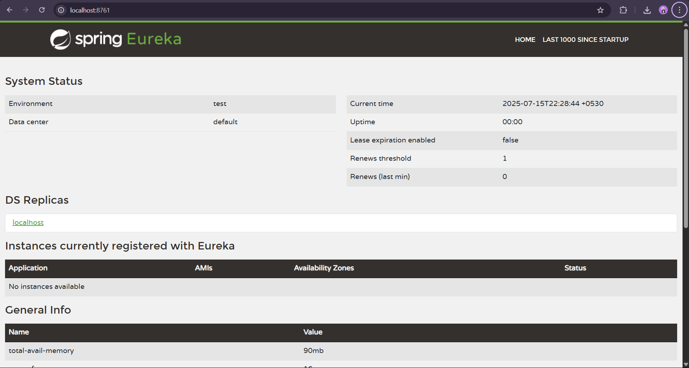
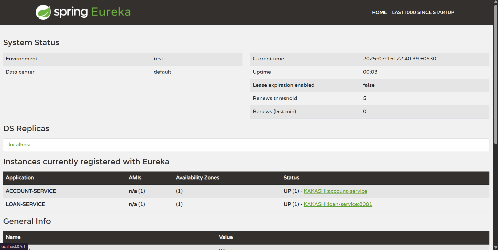

Eureka Discovery Server :

In this exercise, we are asked to create a Eureka Discovery Service and add Account and Loan as instance in it.

Eureka is a service registry where microservices register themselves so they can find and communicate with each other dynamically.

First we created a Eureka Server project file and added the needed dependencies including eureka-server.

Then in the main file we enabled eureka server with @EnableEurekaserver.

After this we run the application and checked the port and had no instances.

Now we add client dependencies to the account and loan pom.xml file and added @EnableDiscoveryClient in main file.

After running the server application, we run the client application (account and loan) and now we can see their instances in the port.

OUTPUT :

