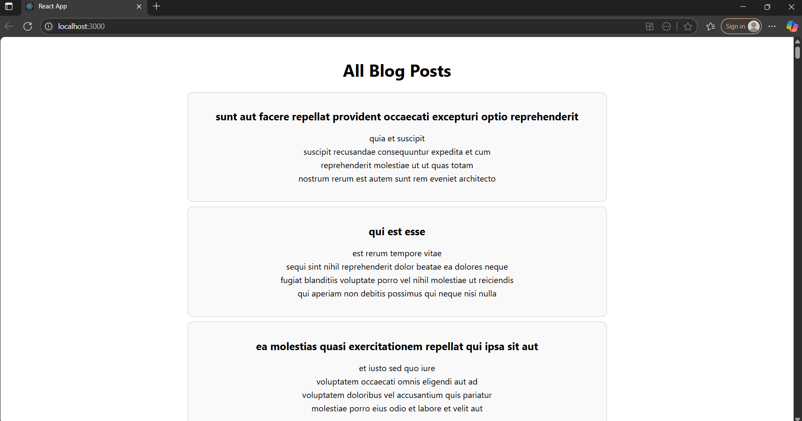

# Output

# 📝 BlogApp

BlogApp is a simple React project that displays a list of blog posts fetched from an online API.

##  What I Did

1. Created a new React app using `create-react-app`.
2. Built a class-based `Posts` component to display blog posts.
3. Used the Fetch API to get data from `https://jsonplaceholder.typicode.com/posts`.
4. Created a custom `Post` class to structure the data.
5. Added error handling to show a message if something goes wrong.

##  What I Learned

- How to use class components and state in React.
- How to fetch data from an API.
- How to display lists using `.map()`.
- Basic error handling in React components.

