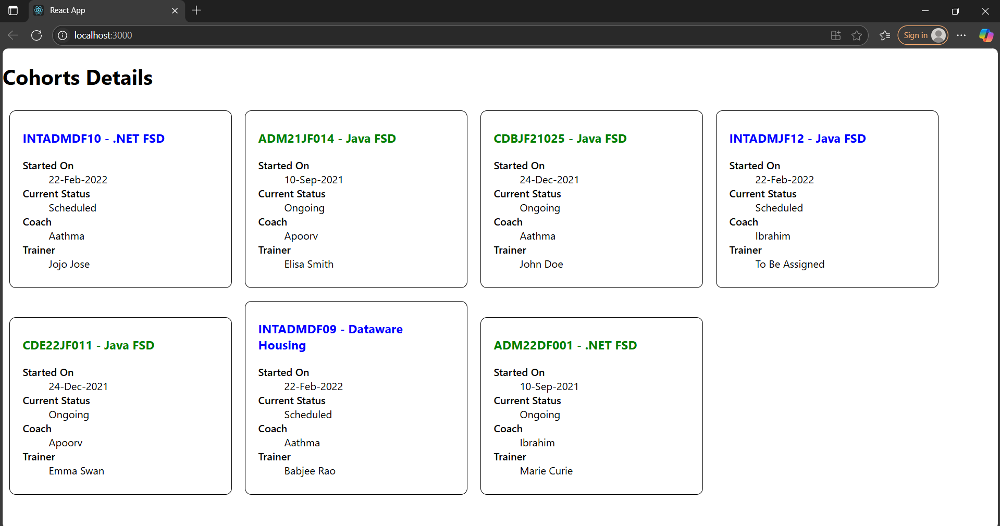

# Output 

# 👥 Cohorts Tracker

This is a small React app that shows details about learning cohorts.

##  What I Did

1. Created a React project using `create-react-app`.
2. Made a `CohortDetails` component to display cohort info.
3. Used a CSS Module to style the component with a box layout.
4. Showed green color if the status is "ongoing", otherwise blue.
5. Styled the `<dt>` tag to make text bolder.

##  What I Learned

- How to use CSS Modules in React.
- How to pass and use props in a component.
- How to style elements based on values (like status).
- Writing clean and simple React components.
