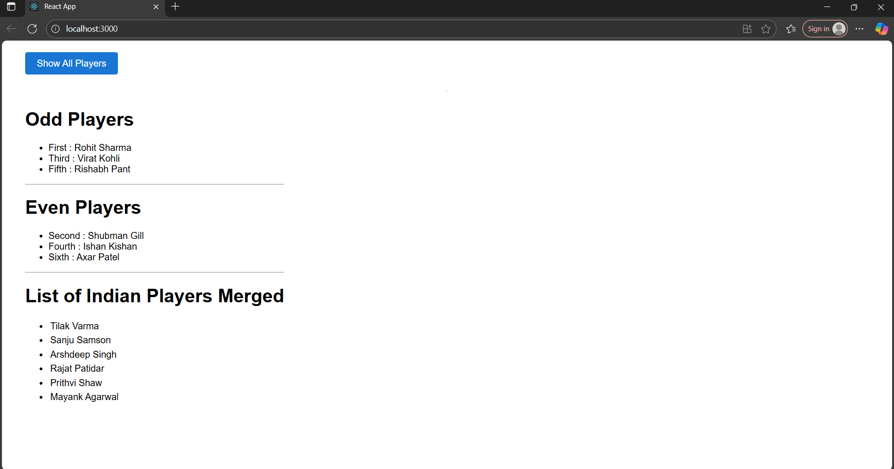

# Output

Cricket App :

In this exercise, we are asked to use arrow, map and destructuring functions of ES6.

First we created a react application named cricketapp.

Then we added the required file with code using map, arrow and all functions of ES6.

Modified the App.js file as required and started to check the output.