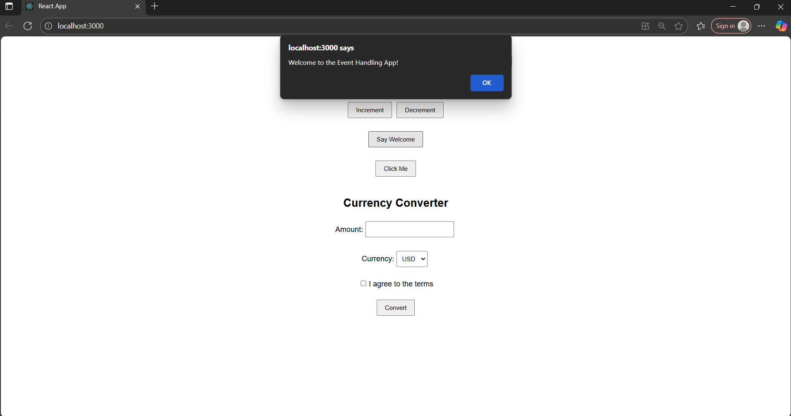
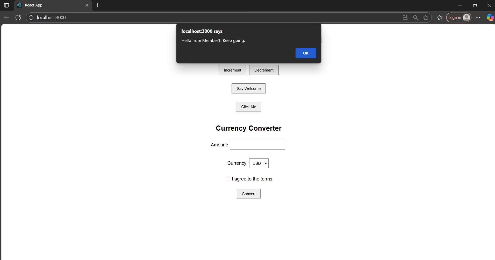
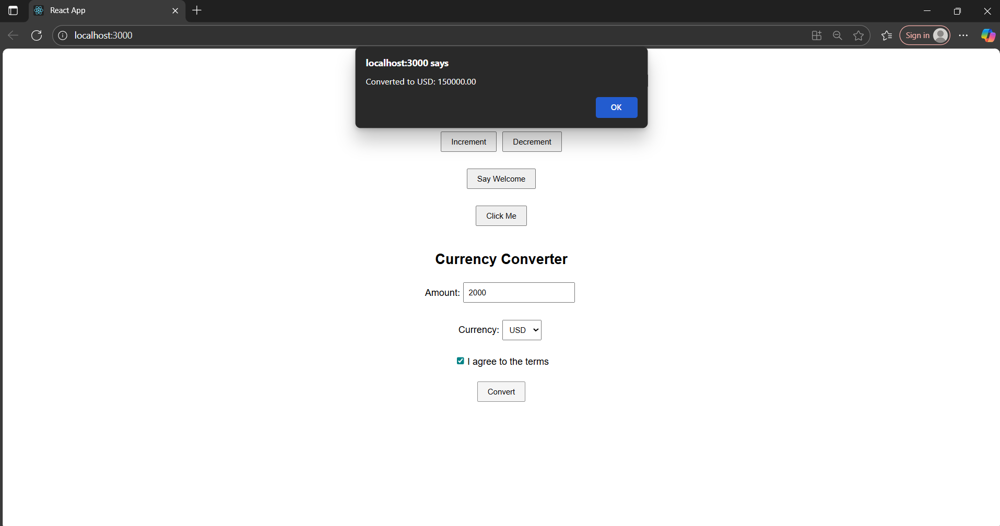

# Output 

Event Examples App :

In this Exercise, we are asked to create events and event handlers.

First we created a react app named eventexamplesapp.

Then we added the events asked and alert messages according to that.

Also added the currency converter for inr to euro.

Finally the output is verified.