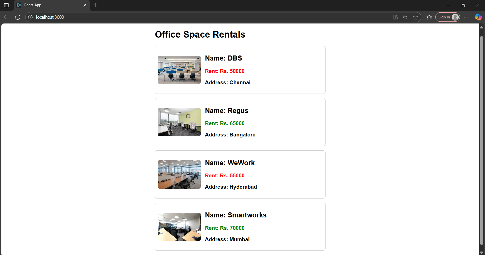

# Output 

Office Space Rent App:

In this Exercise, we are asked to use JSX and use inline CSS in JSX.

First we created a react application named officespacerentalapp.

Then we added the required data and code in the App.js file.

Then changed the App.css file as asked like below 50k red and above 50k green and every other css designs.

Finally started the application and verified the output.