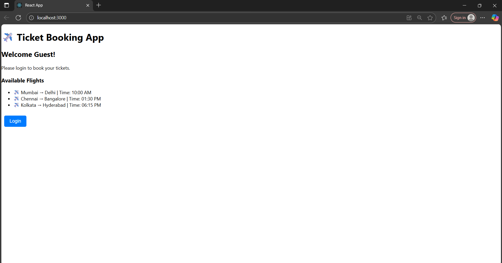
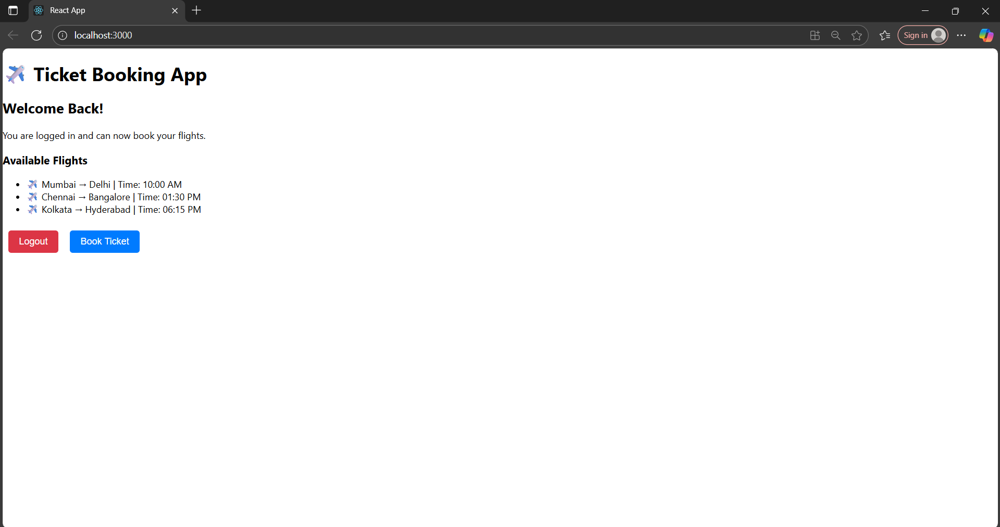

# Output

Ticket Booking App:

In this Exercise, we are asked to do conditional rendering in React.

First we created a react app ticketbookingapp.

Then we added two functions for guest page and user page.

When we click on login in guest page it should render to user page and change the content and button to logout.

After adding the code for this, verified the output.