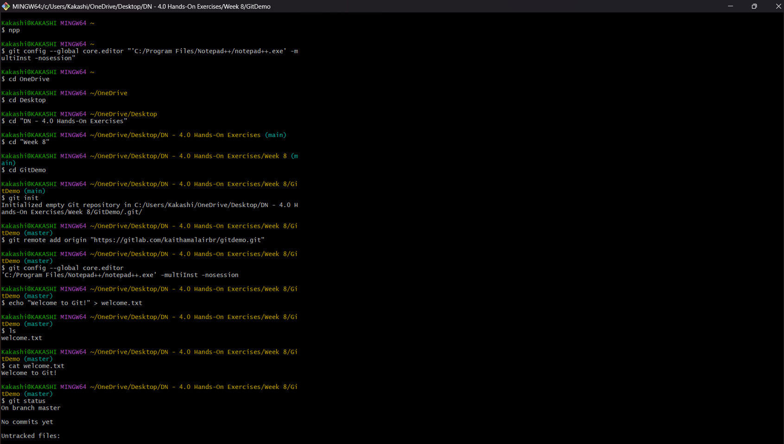
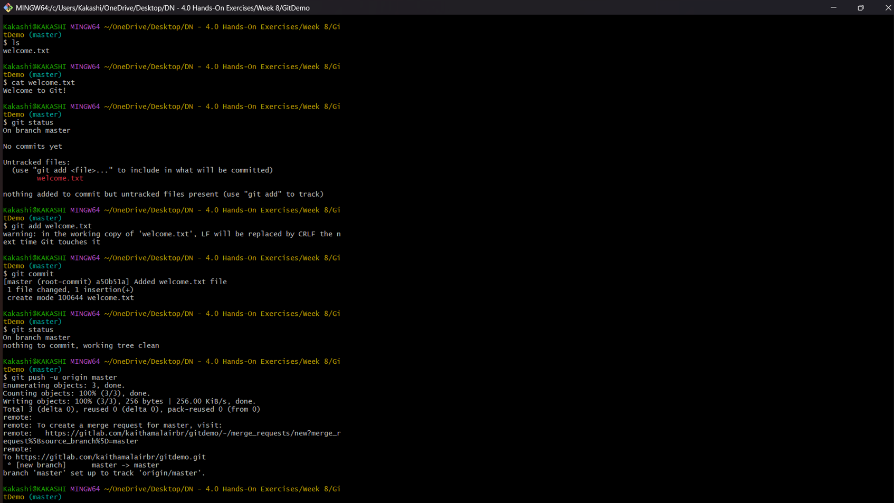
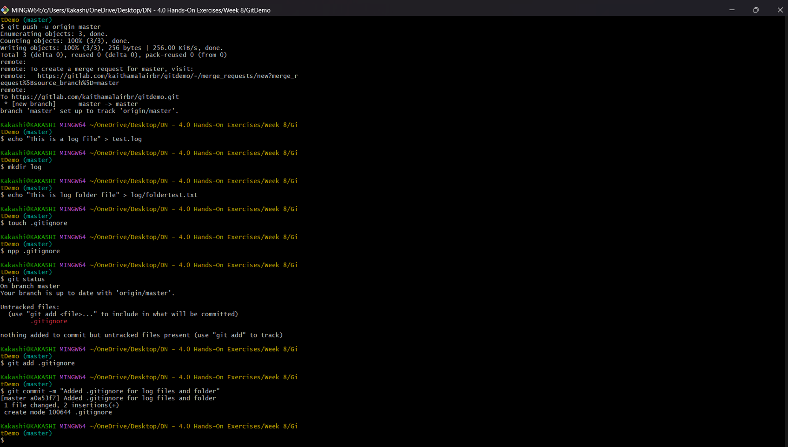
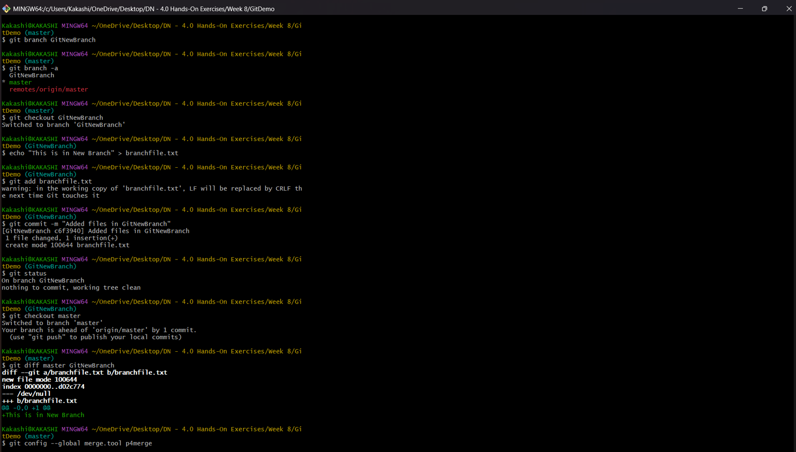
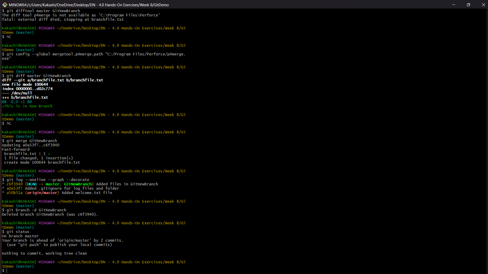
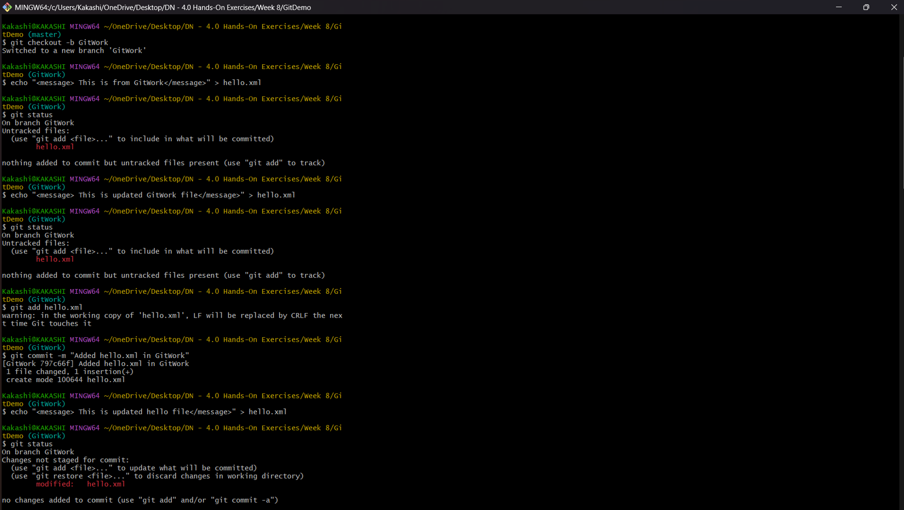
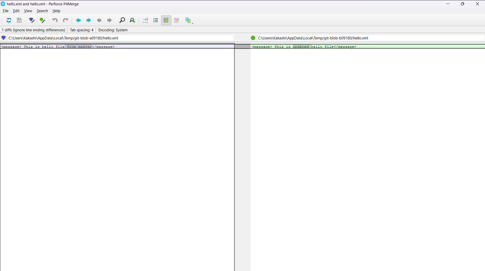
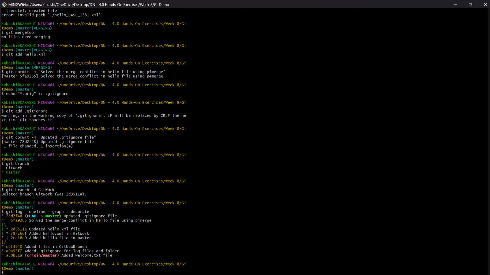
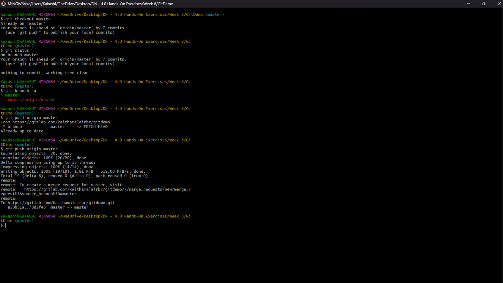
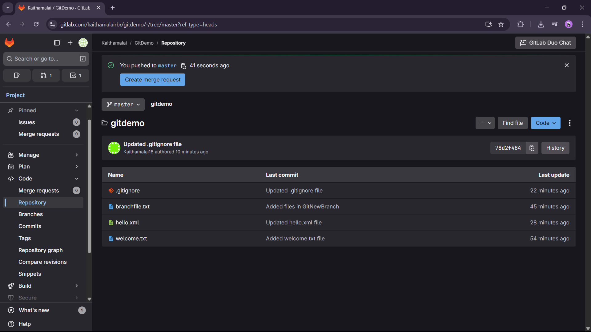

EXERCISE 1 - GIT DEMO :

In this Exercise, we are asked to create gitlab account and also to use notepad++.

First we created a gitlab account and created a empty project named GitDemo.

Then created a local folder named GitDemo and added some sample files.

We set Notepad++ as the default editor for the git.

Then we linked the local and remote repo and commited changes and pushed the files into remote repository.

OUTCOME :

EXERCISE 2 - GIT IGNORE :

In this Exercise, we are asked to add some log files but ignore them in the update.

First we added log file and a file in log folder.

Then we created a .gitignore file and added the log file method we want to delete.

Now when we check the status it will not show the log files as untracked files.

OUTCOME :

EXERCISE 3 -  BRANCHING AND MERGING :

In this Exercise, we are asked to create branches and in the last merge them with master branch.

First we created a new branch and added some files in it.

Then we commited the changes and checked the status. 

After that we switched to the master branch and merged with the new branch and finally deleted it.

OUTCOME :

EXERCISE 4 - GIT WORK :

In this Exercise, we are asked to create a file in new branch and master to handle conflict.

First we created a branch named GitWork and added a hello.xml file.

Then added a hello.xml file in master branch too and committed both the changes.

Now when we merge them we got conflict and we used p4merge tool to manage it.

Finally merged them successfully and deleted the GitWork branch.

OUTCOME :

EXERCISE 5 - MASTER :

In this Exercise, we are asked to list branches and also to pull and push the changes.

First we listed the existing branches.

Then we pulled the changes from remote to local repository.

Finally pushed the changes from local to remote repository.

OUTCOME :

